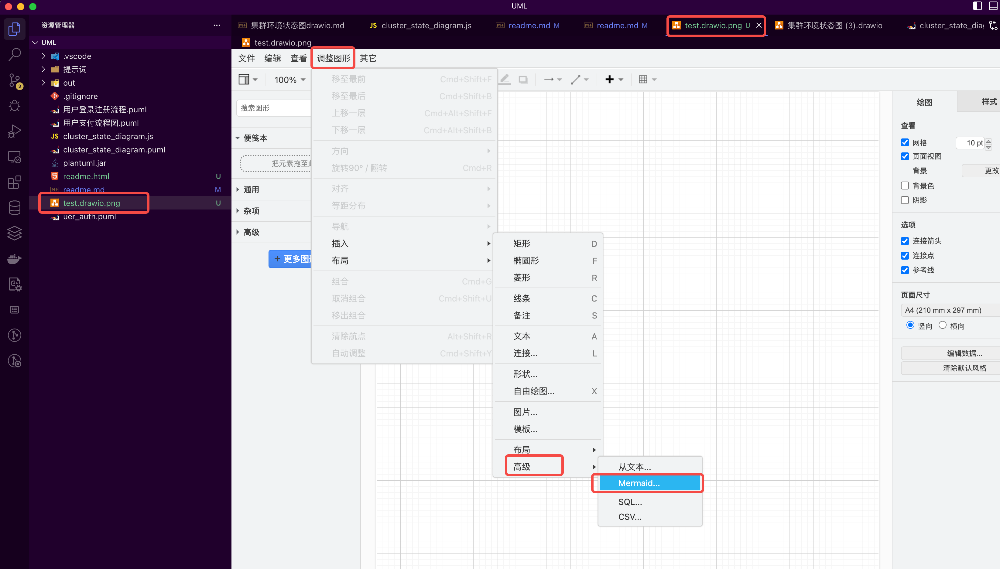
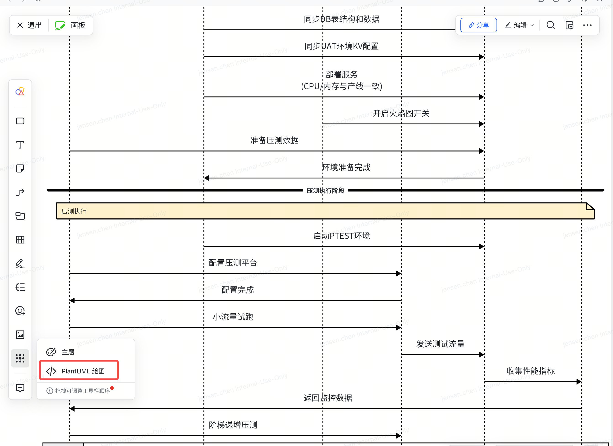

# uml_draw

## PlantUML 绘图

https://plantuml.com/zh/

### 参考链接

https://mp.weixin.qq.com/s/KUnF06ZE6UdyZoDrQCVBwQ

### 生成模型图命令

java -jar plantuml.jar -o out/uer_auth uer_auth.puml

java -jar plantuml.jar -o out/login 用户登录注册流程.puml

java -jar plantuml.jar -o out/payment 用户支付流程图.puml

java -jar plantuml.jar -o out/state_diagram cluster_state_diagram.puml

java -jar plantuml.jar -o out/pts pts_permission_flow.puml

java -jar plantuml.jar -o out/kmeter kmeter_permission_flow.puml
java -jar plantuml.jar -o out/stress_test 压测流程序列图.puml

## 一键生成 Draw.io 流程图

### 生成地址

https://app.diagrams.net/

或者

在 vscod 中创建一个后缀为 .drawio.png 文件就可以开始编辑了

导入 **Mermind** 代码，如下图所示

### 参考链接

https://mp.weixin.qq.com/s/glyPx_QOOBm0keug0bCBMg

### 备注
- 如果要生成支持 draw.io 的 Mermaid 能够成功识别语法代码，需要生成的是 .mmd 文件
- 如果要生成 plantuml 语法代码，需要生成的是 .puml 文件，这种格式的文件可以直接导入到 lark 的画板中

